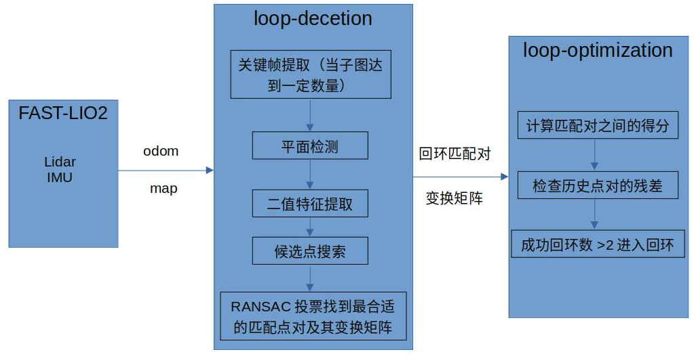
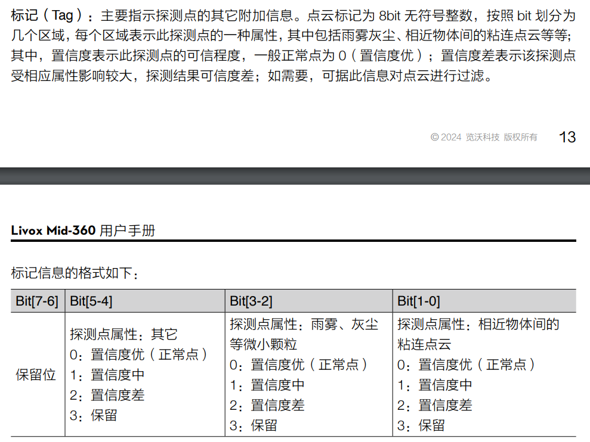
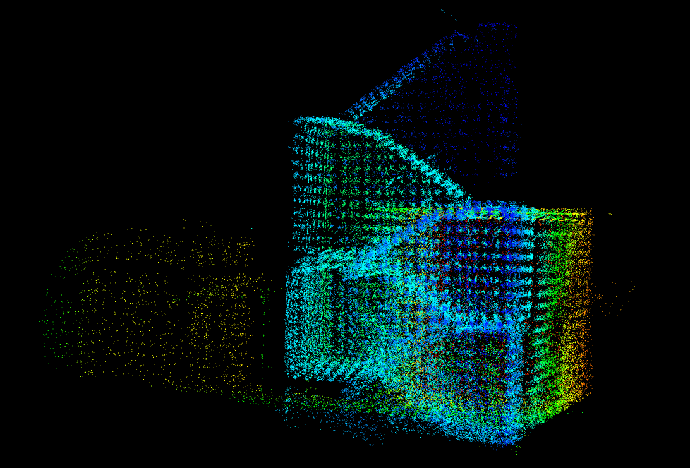
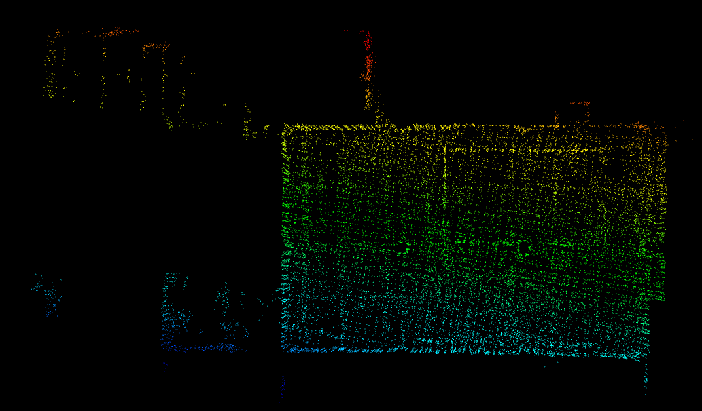

# LTAOM

- [LTAOM](#ltaom)
  - [1 LTAOM框架介绍](#1-ltaom框架介绍)
    - [1.1 基于FAST-LIO2的前端里程计](#11-基于fast-lio2的前端里程计)
    - [1.2 基于STD的回环闭合检测](#12-基于std的回环闭合检测)
      - [1.2.1 关键帧提取](#121-关键帧提取)
      - [1.2.2 平面提取](#122-平面提取)
      - [1.2.3二值特征提取](#123二值特征提取)
      - [1.2.4 候选点搜索](#124-候选点搜索)
      - [1.2.5 RANSAC投票](#125-ransac投票)
    - [1.3 基于FPR的回环优化](#13-基于fpr的回环优化)
      - [1.3.1 匹配对得分计算](#131-匹配对得分计算)
      - [1.3.2 历史点残差计算](#132-历史点残差计算)
  - [2 算法流程介绍](#2-算法流程介绍)
  - [3 算法调试过程中遇到的问题及其解决](#3-算法调试过程中遇到的问题及其解决)
  - [4 主要参数介绍](#4-主要参数介绍)
  - [5 使用说明](#5-使用说明)
    - [5.1 环境及文件配置](#51-环境及文件配置)
    - [5.2 建图流程](#52-建图流程)
  - [6 实验结果](#6-实验结果)

## 1 LTAOM框架介绍

LTAOM主要包含三个模块，首先是基于FAST-LIO2的前端里程计模块，其次是基于STD的回环闭合检测模块，以及基于FPR的回环优化模块。以下对三个模块的主要功能作简要介绍，不涉及细节展开。

###  1.1 基于FAST-LIO2的前端里程计

使用一种高度优化的紧耦合迭代卡尔曼滤波器实时融合LiDAR数据和IMU数据，从而实现精确的状态估计，包括位置、速度和姿态等。主要负责提供地图和里程计数据。

### 1.2 基于STD的回环闭合检测

使用具有旋转和平移不变性的STD描述符，作为回环检测中特征点匹配的基础。接收来自FAST-LIO2的数据，构建STD描述符，计算三角形的相似度，以实现特征匹配，提供回环匹配对。

####  1.2.1 关键帧提取

若发生位移或者角度变化达到一定阈值，则构建一帧子图，每当子图数量大于阈值则构建一关键帧。

#### 1.2.2 平面提取

将关键帧体素化，以哈希表形式存储体素地图，同时采用PCA计算当前关键帧是否为平面，记录体素栅格为键值，平面为实值。

#### 1.2.3二值特征提取

以当前关键帧点云拟合平面方程，将点云投影到平面上，计算点到平面的距离，将投影平面分割为多个区域，并在每个区域内计算二进制描述符。其中二进制描述符包含以下信息：
1. 占据数组 (occupy_array_)：表示在每个距离段（high_inc）内是否有点云点。每个布尔值对应一个距离段，如果该段内有点，则为true，否则为false。
   
2. 索引 (x_index_ 和 y_index_)：分别表示该描述符在投影平面分割网格中的 x 轴和 y 轴的索引。
   
3. 坐标 (x_ 和 y_)：分别表示该描述符在投影平面上的实际二维坐标（可能是区域的平均坐标）。
   
4. 点的数量 (img_count)：表示该区域内的点云点数量。

5. 段距离 (segmnt_dis)：该区域内的有效距离段的数量（即占据数组中为true的数量）。用于衡量该区域内点云点的分布范围和密集程度。

#### 1.2.4 候选点搜索

基于每个关键帧中STD特征的二进制描述符相似度进行筛选，扩展搜索邻域为 $3\times3\times3$，计算STD特征对之间的欧式距离

$$d=\sqrt{(x_2-x_1)^2+(y_2-y_1)^2+(z_2-z_1)^2}$$

计算每两个STD特征的二进制描述符之间的相似度，具体公式如下：

$$\text{Similarity}=\frac{2\times\text{Number of common true bits}}{\text{Total number of true bits in both descriptors}}$$

---

**示例说明**

假设有两个二进制描述符：
- 描述符`A`：`101110`
- 描述符`B`：`100111`

对应的`occupy_array_`：
- `A`的`occupy_array_`：`[true, false, true, true, true, false]`
- `B`的`occupy_array_`：`[true, false, false, true, true, true]`

计算步骤：
1. 遍历数组，找出在同一位置上都为`true`的位数。即第1位、第4位、第5位，共3位。
2. `b1.summary_`为4（`A`中有4个位为`true`）。
3. `b2.summary_`为4（`B`中有4个位为`true`）。
4. 相似性计算为：
    $$\text{Similarity} = \frac{2 \times 3}{4 + 4} = \frac{6}{8} = 0.75$$

---

#### 1.2.5 RANSAC投票

对于每一个STD特征对，计算两者之间的转换矩阵，将该变换应用于其他特征点对，计算变换后点与原始点之间的欧氏距离，并统计满足距离阈值 `dis_threshold` 的特征点对的数量（投票数）。找到投票数最多的索引。

确定最大投票数超过阈值 `ransac_Rt_thr` 后，重新计算最佳特征点对的旋转和平移，并验证所有特征点对，最终将成功匹配和不成功匹配的点对分别存储。


### 1.3 基于FPR的回环优化

在得到匹配结果的基础上，进一步计算回环匹配对之间的体素重复值得分，以避免**假阳性**结果，提高整个系统的准确性和鲁棒性。

#### 1.3.1 匹配对得分计算

对于回环匹配对的两个关键帧，首先将当前帧点云进行变换，对齐至目标帧点云位置；其次将目标帧点云切割成体素网格，记录每个体素网格中的点数；最后将变换后的点云的每个点对应到体素网格中，统计落在已记录体素内的点数。得分计算公式如下：

$$\text{score}=\begin{pmatrix}\frac{\text{count}2}{\text{size of transformed cloud}}\end{pmatrix}\times\text{cloud size ratio}$$

其中，

$$\text{cloud size ratio}=min{\left(\frac{\text{current pt num}}{\text{target pt num}},\frac{\text{target pt num}}{\text{current pt num}}\right)}$$

#### 1.3.2 历史点残差计算

遍历非线性因子图中的因子对，将因子对对应的关键帧进行坐标转换，计算每对点的欧几里德距离残差，小于残差阈值满足回环，当成功回环对数大于等于2，进入回环。

## 2 算法流程介绍

主要流程符合上述三个模块介绍顺序，为前端里程计-->回环检测-->回环优化。

此处分析仅涉及算法中的关键步骤，对于其中的细节处理如平面检测、匹配候选点对搜索、二进制描述符相似度计算等不作详细展开。算法流程图如下：



## 3 算法调试过程中遇到的问题及其解决

1. 问题：运行数据集NCLT的velodyne点云格式报错`Failed to find match for field ‘t’`
   
   原因：LTAOM中自定义的velodyne_ros::point数据格式中的t字段为`uint32_t`对应sensor_msgs::PointCloud2中的time字段，且为`FLOAT`类型，导致两者类型不匹配，进而报错。

    解决方法二选一（代码中已经按照方法二进行了修改）：
    
    方法一：在原始bin文件转bag的python脚本文件[nclt_data2bag_BIN.py](./scripts/nclt_data2bag_BIN.py)中，修改代码为

    ```python
    fields = [PointField('x', 0, PointField.FLOAT32, 1),
        PointField('y', 4, PointField.FLOAT32, 1),
        PointField('z', 8, PointField.FLOAT32, 1),
        PointField('intensity', 12, PointField.FLOAT32, 1),
        PointField('t', 16, PointField.UINT32, 1),
        PointField('ring', 20, PointField.UINT16, 1)]
    ```

    方法二：修改LTAOM中的elodyne点云格式[preprocess.h](./FAST_LIO/src/preprocess.h)

    ```c++
    namespace velodyne_ros
    {
        struct EIGEN_ALIGN16 Point
        {
            PCL_ADD_POINT4D;
            float intensity;
            float time;
            uint16_t ring;
            EIGEN_MAKE_ALIGNED_OPERATOR_NEW
        };
    } // namespace velodyne_ros
    ```

2. 关于NCLT数据集建图坐标系错误
   
   高翔老师解释到，NCLT的IMU在转包的时候转成了Lidar系，于是Lidar与IMU之间没有旋转的外参（本来Lidar是转了90度的），现在Lidar是X左Y后Z下，原车是X前Y右Z下

3. 关于NCLT数据集2013-01-10建图发生飘移
   
   run_all_nclt.launch文件对应的[velody16.yaml](./FAST_LIO/config/velody16.yaml)中存在两个外参，启用第二个明显改善建图效果。

4. 使用2024-03-17-00-27-08.bag建图时，雷达点云数量过少的问题

    FAST-LIO在处理点云时，会对点云中的tag字段进行筛选，导致大部分点云被滤除
    
    [preprocess.cpp](./FAST_LIO/src/preprocess.cpp) 约75行处
    ``` c++ 
    if((msg->points[i].line < N_SCANS) && ((msg->points[i].tag & 0x30) == 0x10)
        || (msg->points[i].tag & 0x30) == 0x00 //mid360
        )
    {
        valid_num ++;
        if (valid_num % point_filter_num == 0)
        {
            pl_full[i].x = msg->points[i].x;
            pl_full[i].y = msg->points[i].y;
            pl_full[i].z = msg->points[i].z;
            pl_full[i].intensity = msg->points[i].reflectivity;
            pl_full[i].curvature = msg->points[i].offset_time / float(1000000); //use curvature as time of each laser points
            {
            pl_surf.push_back(pl_full[i]);
            }
        }
    }
    ```
    但是原始mid360雷达的点云数据中，该字段值的置信度为0才是优，修改代码，以导入所有点云进行建图。

    其中关于tag字段的介绍如下：

    

## 4 主要参数介绍

[avai.yaml](./FAST_LIO/config/avia.yaml)

```yaml
common:
    lid_topic:  "/livox/lidar" # 雷达话题
    imu_topic:  "/imu/data" # IMU话题

preprocess:
    lidar_type: 1                # Livox Avia LiDAR
    scan_line: 4
    blind: 0.1

mapping:
    acc_cov: 0.1 # 加速度计协方差
    gyr_cov: 0.1 # 陀螺仪协方差
    b_acc_cov: 0.2 # 加速度计偏置噪声协方差
    b_gyr_cov: 0.000001 # 陀螺仪偏置噪声协方差
    fov_degree:    90 # 雷达视野范围
    det_range:     10 # 激光雷达的最大探测范围
    # extrinsic_T: [ -0.5165, 0.02326, -0.0284 ]
    extrinsic_T: [ -0.0367, 0.0, -0.1186] #外参
    extrinsic_R: [ 1, 0, 0,
                   0, 1, 0,
                   0, 0, 1]
```

[loopopt_config_avia.yaml](./loop_optimization/launch/loopopt_config_avia.yaml)

```yaml
OverlapScoreThr: 0.3 #回环检测得分阈值，大于该阈值进入回环
VoxelSizeForOverlapCalc: 0.2
NumPrKeyPtFactor: 6
PlaneInlinerRatioThr: 0.5
AdjKPFCov: [0.000001, 0.000001, 0.000001]
LCKPFCov: [0.000001, 0.000001, 0.000001]
MargFCov: [0.000001, 0.000001, 0.000001, 0.0001, 0.0001, 0.0001]
SavePCD: true
PCDSaveStep: 10
PubCorrectedMap: true ## Online pub corrected full map with a frequency
```

[config_avia.yaml](./STD/config/config_avia.yaml)

```yaml
%YAML:1.0

# pre process
ds_size: 0.25
useful_corner_num: 100
stop_skip_enable: 0

# key points
plane_detection_thre: 0.01
plane_merge_normal_thre: 0.1
plane_merge_dis_thre: 0.3
voxel_size: 0.5
voxel_init_num: 10 # 体素点云平面判断的初始阈值
proj_plane_num: 5
proj_image_resolution: 0.2
proj_image_high_inc: 0.1
proj_dis_min: 0
proj_dis_max: 5
summary_min_thre: 0.5
line_filter_enable: 1

# std descriptor
descriptor_near_num: 15
descriptor_min_len: 0.1
descriptor_max_len: 30
max_constrait_dis: 2
similarity_threshold: 0.2 #相似度阈值，大于该阈值进入匹配队列
triangle_resolution: 0.1

# candidate search
skip_near_num: 20 #跳过附近子图匹配的数量
candidate_num: 50 #匹配候选子图的个数
sub_frame_num: 4 #多少个子图构成关键帧
icp_threshold: 0.4 #ICP配准阈值，大于该阈值进入回环检测
ransac_Rt_thr: 1 #RANSAC阈值，大于该阈值进入匹配
rough_dis_threshold: 0.05 #距离阈值超参数，
#dis_threshold = descriptor.triangle_.norm() *rough_dis_threshold_
#小于dis_threshold阈值才计算相似度

#0.2 0.5
normal_threshold: 1.75 #法向量阈值超参数，小于该阈值认为是有用的匹配
dis_threshold: 2 #距离阈值超参数，小于该阈值认为是有用的匹配，两者均用于几何验证

# result record
is_kitti: 1

# extrinsic
T_lidar_to_vehicle: !!opencv-matrix
  rows: 4
  cols: 4
  dt: d
  data: [1,0,0,0,
        0,1,0,0,
        0,0,1,0,
        0,0,0,1]
# gt file: 0 for kitti, 1 for mulran and cu

gt_file_style: 0
```

## 5 使用说明

### 5.1 环境及文件配置

除系统环境外，均提供库源码压缩包，由于LTAOM需要更改gtsam源码，所以建议直接使用文件内压缩包安装（第三方库压缩文件存放于[百度网盘](https://pan.baidu.com/s/1eRoot9EJJ-ItPyU-qKmB7Q?pwd=zssf)中）

1. Ubuntu 20.04
2. ROS noetic
3. ceres 1.14.0
    
    ```
    cd ceres-solver-1.14.0
    mkdir build
    cd build
    cmake -DCMAKE_INSTALL_PREFIX=~/LTAOM_ws/devel ..
    sudo make install
    ```

4. gtsam 4.0.3

    ```
    cd gtsam-4.0.3
    mkdir build
    cd build
    cmake -DCMAKE_INSTALL_PREFIX=~/LTAOM_ws/devel ..
    sudo make install
    ```

5. TBB 2019 Update 9
   
   解压至/home目录下即可，不用编译

6. 在工作空间下新建logs/keyframes目录
7. 编译工作空间

    ```
    cd ~/ws_LTAOM
    catkin_make
    source ~/catkin_ws/devel/setup.bash
    ```

### 5.2 建图流程

livox雷达  

启动fast-lio建图

``` 
roslaunch loop_optimization run_all_avia.launch 
```   

启动回环优化节点

```
rosrun loop_optimization loop_optimization_node
```

为了适应ROLL定位算法的关键帧地图输入，我们将ROLL中关于角点和面点提取的代码移植到LTAOM算法中，同时为了不浪费mid360如此巨大的扫描范围，代码中默认将mid360的点云数据转为128线。建图完毕后提取角点和面点（注意修改文件夹路径）

```
rosrun ysc_t loop_optimization_node corner_surface
```

## 6 实验结果

bag包数据下LTAOM的建图结果如下：



视频：[LTAOM建图示例.mp4](./video/LTAOM建图示例.mp4)

X30实际建图结果如下：



视频：[LTAOM_X30实机建图.mp4](./video/LTAOM_X30实机建图.mp4)

